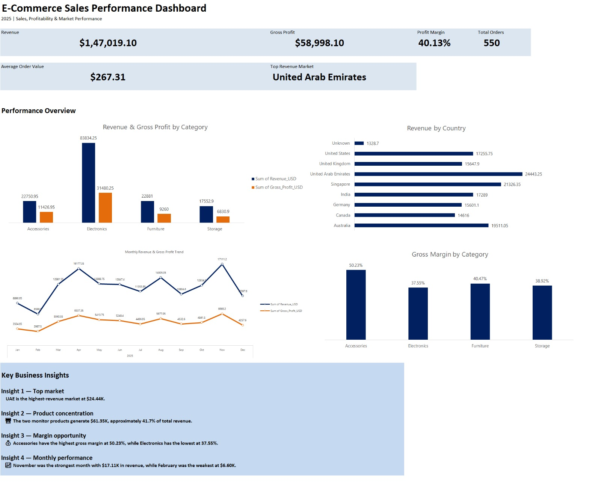

# 📊 E-commerce Sales Analysis — Excel Dashboard

## 📌 Project Overview

This project analyzes e-commerce sales performance using Microsoft Excel to identify trends in revenue, profitability, product performance, market performance, and monthly sales.

The project follows an end-to-end analytics workflow, from data cleaning and preparation to KPI analysis, visualization, and dashboard development.

The final deliverable is an Excel-based **Executive Sales Dashboard** supported by detailed analytical tables and PivotTable analysis.

## 🎯 Business Objective

The analysis was designed to answer key business questions:

* How much revenue and gross profit did the business generate?
* What is the overall profit margin?
* Which product categories contribute the most revenue?
* Which categories generate the strongest margins?
* Which countries generate the most revenue?
* How does sales performance change over time?
* Which products contribute significantly to overall revenue?
* What areas of the business may require further attention?

## 🛠️ Tools & Techniques

**Primary Tool:** Microsoft Excel

**Techniques used:**

* Data cleaning and standardization
* Data validation
* Duplicate handling
* Calculated fields
* Revenue and cost calculations
* Gross profit analysis
* Profit margin analysis
* PivotTables
* KPI analysis
* Data visualization
* Executive dashboard design
* Business insight generation

## 📊 Key Performance Indicators

| KPI                     |                   Result |
| ----------------------- | -----------------------: |
| **Total Revenue**       |          **$147,019.10** |
| **Gross Profit**        |           **$58,998.10** |
| **Profit Margin**       |               **40.13%** |
| **Total Orders**        |                  **550** |
| **Average Order Value** |              **$267.31** |
| **Top Revenue Market**  | **United Arab Emirates** |

## 📈 Dashboard

The Executive Dashboard provides a concise view of overall sales and profitability performance.



### Dashboard Analysis

The dashboard focuses on four main analytical views:

* **Revenue & Gross Profit by Category** — compares sales contribution and profitability across product categories.
* **Monthly Revenue & Gross Profit Trend** — highlights changes in sales and profit performance throughout the year.
* **Revenue by Country** — compares revenue contribution across markets, including records with an unknown country classification.
* **Gross Margin by Category** — identifies categories with stronger and weaker profitability.

## 🔎 Key Business Insights

### 1. Strong Overall Profitability

The business generated **$147,019.10 in revenue** and **$58,998.10 in gross profit**, resulting in an overall gross profit margin of **40.13%**.

### 2. Product Concentration

The two monitor products together generated approximately **$61.35K**, representing around **41.7% of total revenue**.

This indicates that a relatively small number of products contribute a significant share of overall sales.

### 3. Category Profitability

**Accessories** recorded the highest gross margin at approximately **50.23%**, while **Electronics** recorded the lowest at approximately **37.55%**.

This highlights a difference between revenue generation and profitability across categories.

### 4. Market Performance

The **United Arab Emirates** was the highest-revenue market, generating approximately **$24.44K**.

The country analysis also includes an **Unknown** classification for records where the country could not be identified, ensuring that these transactions are not silently excluded from the analysis.

### 5. Monthly Performance

Sales performance varies across the year, with **November** representing the strongest month and **February** the weakest month based on the analyzed dataset.

This suggests potential seasonality or changes in purchasing activity that could be investigated further.

## 💡 Business Recommendations

Based on the observed patterns, the business could consider:

* Reviewing inventory and promotional strategies for high-revenue products.
* Investigating why certain categories generate stronger margins than others.
* Evaluating opportunities in high-performing markets.
* Investigating weaker-performing months to understand potential seasonal patterns.
* Balancing revenue growth with profitability when prioritizing products and categories.

These recommendations are based on patterns observed in the dataset and should be combined with additional business context before making operational decisions.

## 📁 Project Structure

```text
ecommerce-sales-analysis
│
├── Project_01_Ecommerce_Sales_Dashboard.xlsx
│
├── Screenshots
│   └── Project_01_Dashboard.png
│
└── README.md
```

## 📌 Project Outcome

This project demonstrates how Excel can be used to transform raw e-commerce data into a structured business analysis and executive dashboard.

The analysis combines **data preparation, KPI development, PivotTable analysis, profitability analysis, visualization, and business storytelling** to support data-driven decision-making.
